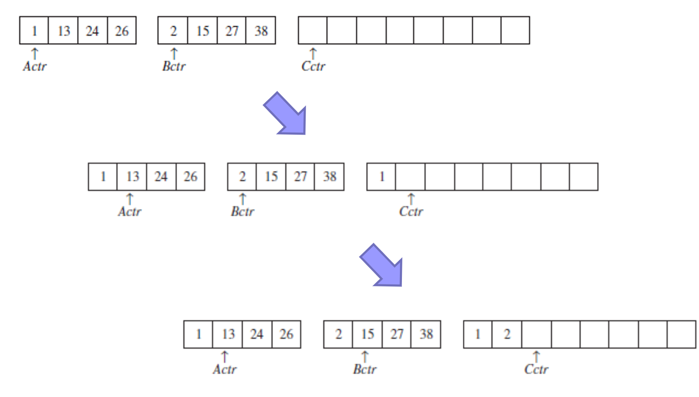
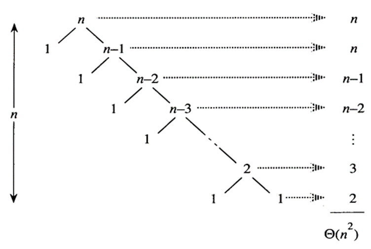

# Sorting (Part 2)

>Note: The most of the information of these lectures was extracted and adapted from Dr Bajuelos and from Weiss’s book, “Data Structures and Algorithm Analysis in Java". They are provided for COP3530 students only. Not to be published or publicly distributed without permission by the publisher. 

## Sorting. The Main Problem 

### Input:

An array A of n data records (n comparable elements)
* A key value in each data record
* A comparison function (consistent and total)

### Output:

Reorganize the elements of A such that
* For i,j, if i<j then A[i] < A[j]

### Alternate way of saying this:
* Given: An unsorted Array
* Goal: Sort it

## Divide and Conquer Methods

Divide and Conquer is a very important technique in algorithm design.

### Main Idea:
Divide problem into sub-problems of smaller size.
Conquer by solving sub-problems recursively. If the sub-problems are small enough, solve them in brute force approach.

Combine the solutions of sub-problems into a solution of the original problem.

## Mergesort
* Sort the left half of the elements (recursively)
* Sort the right half of the elements (recursively)
* Merge the two sorted halves into a sorted whole

## Quicksort
* Pick a “pivot” element
* Divide elements into less-than pivot and greater-than pivot
* Sort the two divisions (recursively on each)
* Combine by doing nothing. Once the conquer step recursively sorts, we are done. 
    * All elements to the left of the pivot, are less than or equal to the pivot and are sorted, and all elements to the right of the pivot are greater than the pivot and are sorted. 

# MergeSort. 
> ## The first example 


### Formalizing the algorithm:
To sort the array, A, from position left to position right:
* if range is 1 element long, it is already sorted! (Base case)
* else: 
    * Sort from (left . . . A[(right + left) / 2] )
    * Sort from (A[(right + left)/2  + 1] . . . right)
    * Merge the two halves together

 
 ## MergeSort. The Merge step 

The fundamental operation is merging two sorted arrays.

Mergesort uses extra space proportional to n.

### Some facts:
* (not hard). Use auxiliary array of length ~ ½ n instead of n. 
* (very hard). in-place version of Mergesort. 

### How to merge two sorted array?
The basic merging algorithm takes two input arrays A and B, an output array C, and three counters: Actr, Bctr, and Cctr
Actr, Bctr and Cctr are initially set to the beginning of their respective arrays.

The smaller of A[Actr] and B[Bctr] is copied to the next entry in C, and the appropriate counters are advanced. 
When either input list is exhausted, the remainder of the other list is copied to C.

### Example 1




### Example #2


Visualization:

http://www.cs.usfca.edu/~galles/visualization/ComparisonSort.html

### MergeSort. Algorithm Analysis 

To sort an array of n elements, we have:

* Step 1: If the problem size is small, solve this problem directly; otherwise, split the  original problem into 2 sub-problems with equal sizes.
* Step 2: Recursively solve these 2 sub-problems by applying this algorithm.
* Step 3: Merge the solutions of the 2 sub-problems into a solution of the original problem.

So, our recurrence relation is:
* T(1) = c<sub>1</sub>
* T(n) = 2T(n/2) + c<sub>2</sub>n

Where c<sub>2</sub>n is the merging step.

Assume that c<sub>1</sub> = c<sub>2</sub> = 1 (not affect the asymptotic behavior):

T(1) = 1          

For the first split:

T(n) = 2T(n/2) + n                            

For the first and second split:

T(n) = 2(2T(n/4) + n/2) + n        

= 4T(n/4) + 2n                          

For the third split:

T(n) = 4(2T(n/8) + n/4) + 2n     

= 8T(n/8) + 3n                          

Therefore you can assume:

T(n) = 2<sup>k</sup>T(n/2<sup>k</sup>) + kn   

Assume than n = 2<sup>k</sup> then n/2<sup>k</sup>= 1  ( i.e., log n = k )

T(n) = 2<sup>log<sub>2</sub>n</sup> T(1) + n log n

T(n) = n + n log n

## T(n) = O(n log n)

Recall that we have assumed n = 2k. The analysis can be refined to handle cases when n is not a power of 2. The answer turns out to be almost identical.

## Insertion Sort vs Merge Sort

* home PC executes 10<sup>8</sup> compares/second.
* supercomputer executes 10<sup>12</sup> compares/second
	


(from http://algs4.cs.princeton.edu/lectures/22Mergesort.pdf)

See Java Code of MergeSort in:

http://users.cis.fiu.edu/~weiss/dsj2/code/Sort.java

(Prof. Mark Weiss)

Recommended material:

http://algs4.cs.princeton.edu/lectures/keynote/22Mergesort.pdf


# QuickSort

A divide-and-conquer algorithm.

The classic quicksort algorithm to sort an array S consists of the following four steps:

* If the number of elements in S is 0 or 1, then return.
* Pick any element v in S. This is called the pivot.
* Partition S at {v} into two disjoint groups that do not include v:
    * S1 = {index [x]  ≤ [v]}
    * S2 = {index [x]  > [v]}
* Return {quicksort(S1) join v join quicksort(S2)}.


### Example 3 


### Example 4


## QuickSort. Key steps

How to pick a pivot? 
* Any choice is correct i.e. data will end up sorted.
    * But as analysis will show, you want the two partitions to be about equal in size.

How to partition?
* In linear time.
* In place.

For example: Use the first element as pivot
* if the input is random, ok
* if the input is presorted (or in reverse order)
    * all the elements go into S2 (or S1)
    * this happens consistently throughout the recursive calls
    * Results in O(n<sup>2</sup>) behavior!!!

### Example 5: Sort (4,6,7,8,9,12,15)

Choose the pivot randomly
* generally safe
* random number generation can be expensive

Heuristic 
* that tends to work well
* While sorting arr from left to right-1 we can choose the pivot as the median of 3 elements.         

For example: 

arr[left], arr[right-1], arr[(right+left)/2]

### QuickSort. Partitioning Strategy

After picking pivot, need to partition in linear time in place
* Step for a general idea of good in-place partitioning:
	```text
    swap pivot with arr[left]
	Use two pointers i and j, 
           (starting at left+1 and right-1)
	while (i < j)
	    if (arr[j] > pivot) j--
	    else if (arr[i] < pivot) i++
	    else swap arr[i] with arr[j]
	 swap pivot with arr[i]**
	**skip this step if pivot ends up being the min element
    ```
Note that this procedure can be adapted to swap the pivot with the arr[right]

### Example #6:
Sort (8,1,4,9,0,3,5,2,7,6)

Step one: pick pivot as median of 3
* left = 0, right = 10 (arr.length), middle = 6 (arr.length/2)


* pivot = 6

Step two: move pivot to the left position.
* pointers i = left +1;  j = right -1


Step Three:


Step 4: Apply partioning algorithm.

Example:

http://www.w3resource.com/c-programming-exercises/searching-and-sorting/c-search-and-sorting-exercise-7.php

## QuickSort. Analysis

Best-case: Pivot is always the median
* T(0)=T(1)=1
* T(n)=2T(n/2) + n          
    * O(n) for the partition step
* The same recurrence as Merge-sort: O(n log n)

Worst-case: Pivot is always smallest or largest element
* T(0)=T(1)=1
* T(n) = T(n-1)  + n   
* The same recurrence as Selection-sort: O(n2)

Average-case (e.g., with random pivot):

O(n log n) (consult the text book for the proof)

Best case:


Worst case:





## QuickSort. Small Arrays

For small arrays (n ≤ 20, for example) Quicksort does not perform as well as insertion sort but these cases will occur frequently (QuickSort is recursive!).

A common solution: use a sorting algorithm that is efficient for small arrays, such as Insertion sort.

Engineering rule: switch algorithm below a cutoff for example use insertion sort for n < 10.

### Cutoff sample code:
```java
private static void quicksort( Comparable [ ] a, int low, int high )
{
        if( low + CUTOFF > high )
            insertionSort( a, low, high );
        else
        {
           ...
        }
}
```
Note: Could also use a cutoff for Mergesort

## Insertion Sort vs Merge Sort vs QuickSort

* home PC executes 10<sup>8</sup> compares/second.
* supercomputer executes 10<sup>12</sup> compares/second


See Java Code of QuickSort in:

http://users.cis.fiu.edu/~weiss/dsj2/code/Sort.java

(Prof. Mark Weiss)

Visualization:

http://www.cs.usfca.edu/~galles/visualization/ComparisonSort.html

https://www.youtube.com/watch?v=ywWBy6J5gz8

Some Facts:

https://algs4.cs.princeton.edu/lectures/keynote/23Quicksort.pdf

## A General Lower Bound for Sorting 
How Fast Can We Sort?

* Heapsort & Mergesort have O(NlognN) worst-case running time.
* Quicksort has O(NlogN) average-case running time

Theorem: Comparison sorting is Ω(NlogN) at best.

Cannot comparison-sort in linear time!

## The Master Theorem 

Let a >= 1, b > 1, d >= 0, and T(N) be a monotonically increasing function of the form:

T(N) = aT(N/b)  + O(N<sup>d</sup>);

* a is the number of subproblems
* N/b is the size of each subproblem
* Nd is the “work done” to prepare the subproblems and assemble/combine the subresults

Then:
* T(N) is O(N<sup>d</sup>); 	if a < b<sup>d</sup> 
* T(N) is O(N<sup>d</sup>logN);	if a = b<sup>d</sup>
* T(N) is O(N<sup>log<sub>d</sub>a</sup>);	if a > b<sup>d</sup>


## Sorting in Linear Time? 

### Yes! (but with non-comparison sort)

Condition: if all values to be sorted are known to be integers between 1 and K (or any small range).

## Bucket Sort Algorithm:

* Create an array of size K. 
* Put each element in its proper bucket. 
* If data is only integers, no need to store more than a count of how times that bucket has been used.
* Output result via linear pass through array of buckets.


Example: 
if K=5 and for example:
Input: (5,1,3,4,3,2,1,1,5,4,5)


Output: (1,1,1,2,3,3,4,4,5,5,5)


Overall running time complexity: O(N+K)
* Linear in N, but also linear in K
* (NlogN) lower bound does not apply because this is not a comparison sort

Good method when K is smaller (or not much larger) than N
* We don’t spend time doing comparisons of duplicates

Bad when K is much larger than N
* Wasted space; wasted time during linear O(K) pass

## RadixSort

Main Idea:

* Use the Bucket sort on one digit at a time
* Number of buckets = radix
* Starting with Least Significant Digit (LSD)
* Keeping sort stable
* Do one pass per digit (to Most Significant Digit, MSD)
* Invariant: After k passes (digits), the last k digits are sorted


### Example
d (digit) = 3, r (radix) = 10; 
Input: 179, 208, 306, 93, 859, 984, 55, 9, 271, 33


After 1st Pass: 271, 93, 33, 984, 55, 306, 208, 179, 859, 9


After 2nd Pass: 306, 208, 9, 33, 55, 859, 271, 179, 984, 93

New input: 306, 208, 9, 33, 55, 859, 271, 179, 984, 93


After 3st Pass: 9, 33, 55, 93, 179, 208, 271. 306, 859, 984

Sorted!

### Radix Sort. Analysis

* Input size: Array of N elements
* Number of buckets= Radix: r
* Number of passes = # of “digits”: d
* Work per pass is 1 bucket sort: O(r + N)
* The running time complexity of RadixSort is O(d*(r+N))

Compared to comparison sorts, sometimes a win, but often not

Example: Strings of English letters (52 = 26 upper + 26 lower cases) up to length 15
* Run-time proportional to: 15*(52 + N) 
* 15*(52 + N) < NlogN only if N > 33,000

# Summary on Sorting Algorithms

Simple O(N2) sorts can be fastest for small N.
* Selection sort (unstable), Insertion sort (stable).
* Used as “cut-off” to accelerate MergeSort and QuickSort.

Shell sort – first sub-quadratic, O(N<sup>1.5</sup>), comparison sort algorithm. Unstable algorithm.

O(NLogN) comparison sort algorithms:
* HeapSort, in-place and unstable.
* MergeSort, not in-place and stable.
* QuickSort, in-place, unstable and O(N<sup>2</sup>) in worst-case.

Lower bound for comparison sort - O(NLogN) 

Non-comparison sort algorithms – O(N):
* BucketSort good for small number of possible key values.
* RadixSort uses fewer buckets and more phases.


https://www.youtube.com/watch?v=kPRA0W1kECg

# Class Problem

## Hybrid QuickSort Algorithm

In this problem, a hybrid of the Quicksort with Insertion Sort is discussed to achieve better performance.


A Hybrid Algorithm is an algorithm that combines two or more other algorithms that solve the same problem, either choosing one (depending on the data) or switching between them throughout the algorithm. This is generally done to combine each of the desired features so that the overall algorithm is better than the individual components.

Quicksort is one of the fastest sorting algorithms for sorting large data. When implemented well, it can be about two or three times faster than its main competitors, merge sort and heapsort. There have been various variants proposed to boost its performance. 

Hybrid with Insertion Sort:

When the total number of elements is below some threshold (perhaps ten elements), switch to a non-recursive sorting algorithm such as insertion sort that performs fewer swaps, comparisons, or other operations on such small arrays.

Instead of “many small sorts” optimization, we can stop when the total number of elements is less than some threshold k. Later, when the whole array has been processed, each element will be at most k positions away from its final sorted position. Now, if we perform insertion sort on it, it will take O(K*n) time to finish the sort, which is linear as k is a constant.

```java
import java.util.Arrays;
import java.util.Random;
 
class Main
{
    // Total number of elements to be sorted
    private static final int N = 10000;
 
    // Total number of sorting runs
    private static final int NUM = 10;
 
    // Function to perform insertion sort on `arr[]`
    public static void insertionSort(int[] arr, int low, int n)
    {
        // Start from the second element (the element at index 0
        // is already sorted)
        for (int i = low + 1; i <= n; i++)
        {
            int value = arr[i];
            int j = i;
 
            // find index `j` within the sorted subset `arr[0…i-1]`
            // where element `arr[i]` belongs
            while (j > low && arr[j - 1] > value)
            {
                arr[j] = arr[j - 1];
                j--;
            }
 
            // note that subarray `arr[j…i-1]` is shifted to
            // the right by one position, i.e., `arr[j+1…i]`
 
            arr[j] = value;
        }
    }
 
    public static int partition(int[] a, int low, int high)
    {
        // Pick the rightmost element as a pivot from the array
        int pivot = a[high];
 
        // elements less than the pivot will be pushed to the left of `pIndex`
        // elements more than the pivot will be pushed to the right of `pIndex`
        // equal elements can go either way
        int pIndex = low;
 
        // each time we find an element less than or equal to the pivot,
        // `pIndex` is incremented, and that element would be placed
        // before the pivot.
        for (int i = low; i < high; i++)
        {
            if (a[i] <= pivot)
            {
                int temp = a[i];
                a[i] = a[pIndex];
                a[pIndex] = temp;
 
                pIndex++;
            }
        }
 
        // swap `pIndex` with pivot
        int temp = a[high];
        a[high] = a[pIndex];
        a[pIndex] = temp;
 
        // return `pIndex` (index of the pivot element)
        return pIndex;
    }
 
    public static void quicksort(int[] a, int low, int high)
    {
        // base condition
        if (low >= high) {
            return;
        }
 
        // rearrange elements across pivot
        int pivot = partition(a, low, high);
 
        // recur on subarray containing elements less than the pivot
        quicksort(a, low, pivot - 1);
 
        // recur on subarray containing elements more than the pivot
        quicksort(a, pivot + 1, high);
    }
 
    public static void optimizedQuicksort(int[] A, int low, int high)
    {
        while (low < high)
        {
            // switch to insertion sort if the size is 10 or smaller
        
            //TODO
        
        }
    }
 
    public static void main(String[] args)
    {
        int[] arr = new int[N];
 
        // to measure the time taken by optimized and non-optimized Quicksort
        long begin, end;
        long t1 = 0, t2 = 0;
 
        // perform Quicksort NUM times and take an average
        for (int i = 0; i < NUM; i++)
        {
            // generate random input
            Arrays.fill(arr, new Random().nextInt());
            int[] dup = Arrays.copyOf(arr, N);
 
            // Perform non-optimized Quicksort on the array
 
            begin = System.nanoTime();
            quicksort(arr, 0, N - 1);
            end = System.nanoTime();
 
            // calculate the time taken by non-optimized Quicksort
            t1 += (end - begin);
 
            // Perform optimized Quicksort on the duplicate array
            begin = System.nanoTime();
            optimizedQuicksort(dup, 0, N - 1);
            end = System.nanoTime();
 
            // calculate the time taken by optimized Quicksort
            t2 += (end - begin);
        }
 
        System.out.println("The average time taken by the non-optimized Quicksort: " +
                t1/NUM + "ns");
        System.out.println("The average time taken by the optimized Quicksort: " +
                t2/NUM + "ns");
    }
}
```
